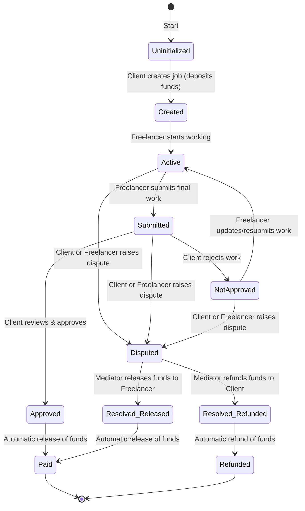
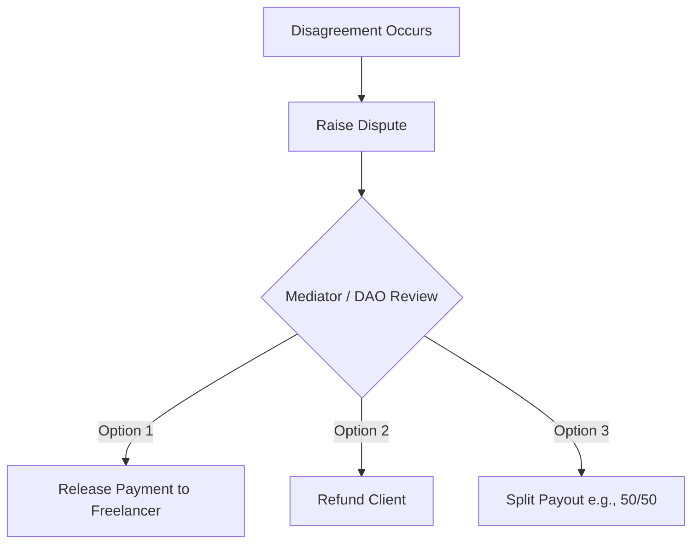

# Product Requirement Document (PRD)
## Blockchain-Based Escrow System

| Attribute | Details |
| :--- | :--- |
| **Document Version** | v1.0.0 |
| **Status** | Draft (Pending Review) |
| **Date** | May 25, 2026 |
| **Author** | Antigravity AI |
| **Target Directory** | `c:\Users\HP\Desktop\Solidity` |

---

## 1. Executive Summary

### 1.1 Problem Statement
Traditional freelance platforms charge high intermediary fees (often 5% to 20%), delay payouts due to centralized clearing processes, and lack transparent dispute resolution mechanisms. Clients risk losing funds for uncompleted work, while freelancers face the risk of non-payment after delivering high-quality deliverables.

### 1.2 Proposed Solution
A **decentralized, smart contract-based Escrow System** that eliminates intermediaries, drastically reduces fees, and locks client funds in a tamper-proof blockchain vault. Funds are only released when the client approves the work or when an independent dispute resolution mechanism (Mediator/DAO) decides on a fair allocation.

---

## 2. Product Scope & Core Workflows

The escrow contract acts as a trustless state machine. Below is the precise state transition flow based on the system design:



---

## 3. Detailed Step-by-Step Functional Specifications

### Step 1: Client Creates New Job & Enters Freelancer Address
* **Actor**: Client
* **Actions**: 
  * Fills out job details (Title, Description, Deliverables hash).
  * Specifies the **Freelancer's Wallet Address** (`address`).
  * Specifies the **Mediator's Wallet Address** (`address`) for dispute resolution.
  * Inputs the payment amount in Native Currency (e.g., ETH) or supported ERC-20 token.

### Step 2: Client Deposits Funds into Smart Contract
* **Actor**: Client
* **Actions**:
  * Triggers the `createJob` transaction on the smart contract.
  * Sends the agreed payment amount (locked in escrow).
* **Smart Contract Behavior**: 
  * Contract transitions the job status to `Created`.
  * Emits `JobCreated(jobId, client, freelancer, amount)`.
  * The deposited funds are safely stored in the contract's balance.

> [!IMPORTANT]
> The funds must be fully locked in the smart contract's state *before* the freelancer commences work. There is no possibility for the client to unilaterally withdraw the funds once the job status transitions to `Active` without triggering a refund or dispute mechanism.

### Step 3: Freelancer Starts Working
* **Actor**: Freelancer
* **Actions**:
  * Views the active job on the Web3 interface.
  * Verifies that the correct amount has been locked in the contract.
  * Clicks "Accept Job" to flag commitment.
* **Smart Contract Behavior**:
  * Status transitions from `Created` to `Active`.
  * Emits `JobAccepted(jobId)`.

### Step 4: Freelancer Submits Final Work
* **Actor**: Freelancer
* **Actions**:
  * Completes work and uploads deliverables (e.g., to IPFS or a git repository).
  * Inputs the proof of work (e.g., IPFS hash, repository commit link).
  * Submits the transaction `submitWork` to the contract.
* **Smart Contract Behavior**:
  * Status transitions to `Submitted`.
  * Deliverable URI is saved to state.
  * Emits `WorkSubmitted(jobId, deliverableUri)`.

### Step 5: Client Reviews & Approval Decision
* **Actor**: Client
* **Actions**:
  * Reviews the submitted work.
  * Selects **Approve** or **Reject (Not Approved)**.

#### Scenario A: Approved
* **System Action**: 
  1. Client calls `approveWork`.
  2. Smart contract transitions status to `Paid`.
  3. Smart contract automatically transfers the locked escrow funds to the Freelancer's address.
  4. Emits `JobCompleted(jobId)` and `FundsReleased(jobId, freelancer, amount)`.

#### Scenario B: Not Approved
* **System Action**:
  1. Client calls `rejectWork` (must provide feedback).
  2. Status transitions to `NotApproved`.
  3. Emits `WorkRejected(jobId, reason)`.
  4. Funds remain securely locked in the escrow contract.
  5. Freelancer updates deliverables and goes back to **Step 4 (Freelancer Submits Work)**.

---

## 4. Optional Dispute Flow

When the Client and Freelancer reach an impasse (e.g., the client rejects the work multiple times, or the freelancer refuses to update the work), either party can escalate the situation.



### 4.1 Raise Dispute
* **Trigger**: Either Client or Freelancer calls `raiseDispute(jobId)`.
* **Smart Contract Behavior**:
  * State transitions to `Disputed`.
  * Emits `DisputeRaised(jobId, raisedBy)`.

### 4.2 Mediator/DAO Review & Resolution
* **Actor**: Designated Mediator (or DAO address specified during job creation).
* **Actions**:
  * Evaluates the agreement deliverables, freelancer submissions, and client feedback.
  * Resolves the dispute via a three-way outcome path:
    1. **Resolve in Favor of Freelancer**: Calls `resolveDispute(jobId, 100, 0)` -> 100% of funds sent to the Freelancer.
    2. **Resolve in Favor of Client**: Calls `resolveDispute(jobId, 0, 100)` -> 100% of funds refunded to the Client.
    3. **Split Resolution**: Calls `resolveDispute(jobId, 60, 40)` -> Split ratio (e.g., 60% Freelancer, 40% Client).
* **Smart Contract Behavior**:
  * Emits `DisputeResolved(jobId, mediator, freelancerAmount, clientAmount)`.
  * Distributes funds accordingly.
  * State transitions to `Paid` (if freelancer paid) or `Refunded` (if client refunded).

> [!WARNING]
> To prevent a malicious mediator from keeping the funds, the mediator's address **must not** be allowed to withdraw escrow funds to their own account, unless a designated mediation fee is coded directly into the contract logic.

---

## 5. Technical Requirements & Architecture

### 5.1 Smart Contract Specification (Solidity)

#### State Variables & Data Structures
```solidity
enum JobStatus { Uninitialized, Created, Active, Submitted, NotApproved, Disputed, Paid, Refunded }

struct Job {
    uint256 id;
    address payable client;
    address payable freelancer;
    address mediator;
    uint256 amount;
    string deliverableHash; // IPFS hash / Deliverable proof URL
    JobStatus status;
    uint256 createdAt;
}

mapping(uint256 => Job) public jobs;
uint256 public jobCount;
```

#### Key Functions
| Function | Access Control | Allowed Status | Description |
| :--- | :--- | :--- | :--- |
| `createJob(address _freelancer, address _mediator)` | Public (Payable) | `None` | Instantiates a job, locks sent ETH, and sets status to `Created`. |
| `acceptJob(uint256 _jobId)` | Freelancer | `Created` | Freelancer accepts the job, sets status to `Active`. |
| `submitWork(uint256 _jobId, string _deliverableHash)` | Freelancer | `Active`, `NotApproved` | Freelancer uploads deliverables, sets status to `Submitted`. |
| `approveWork(uint256 _jobId)` | Client | `Submitted` | Client accepts work, releases funds, sets status to `Paid`. |
| `rejectWork(uint256 _jobId, string _reason)` | Client | `Submitted` | Client rejects work, requests modifications, sets status to `NotApproved`. |
| `raiseDispute(uint256 _jobId)` | Client or Freelancer | `Active`, `Submitted`, `NotApproved` | Flags the job as in dispute, locks state, transfers authority to mediator. |
| `resolveDispute(uint256 _jobId, uint256 _freelancerShare, uint256 _clientShare)` | Mediator | `Disputed` | Divides and releases funds according to mediator decision. Sets status to final state. |

---

## 6. Non-Functional & Security Requirements

### 6.1 Security Auditing & Code Vulnerabilities
* **Reentrancy Protection**: Use OpenZeppelin's `ReentrancyGuard` on all state-changing fund transfers (`nonReentrant` modifier).
* **Checks-Effects-Interactions Pattern**: Always update the job state variables (`JobStatus`) *before* executing the transfer of Ether or tokens to avoid reentrancy loops.
* **Input Validation**: 
  * Validate that `_freelancer` and `_mediator` are not zero addresses (`address(0)`).
  * Validate that the locked funds are greater than `0`.
  * Assert that only the assigned Mediator can trigger `resolveDispute`.

### 6.2 Gas Optimization
* Optimize storage layout by keeping storage packing efficient (e.g., grouping `enum` and small integer variables).
* Use external functions instead of public functions when the call only happens from external Web3 triggers.

---

## 7. Web3 Frontend Mockup Specifications

### 7.1 Client Dashboard View
* **Job Creation Panel**: Text inputs for Freelancer Address, Mediator Address, Deliverables description, and an input box for the budget in Ether.
* **Ongoing Escrows Table**: Displays list of jobs, showing columns for `Job ID`, `Freelancer`, `Budget`, `Current Status`, and a "Review Work" button if state is `Submitted`.

### 7.2 Freelancer Dashboard View
* **Acceptance Portal**: Allows freelancer to see pending jobs (`Created`) where their address is assigned.
* **Workspace Panel**: Once active, displays a text field to paste an IPFS CID or repository link and click "Submit Deliverable".
* **Dispute Handler**: Shows a red button to "Escalate to Mediator" if payment is delayed.

---

## 8. Verification & Test Plan

To ensure the Solidity implementation operates exactly as requested, the following test scenarios must be validated using Foundry or Hardhat:

### 8.1 Automated Test Suites
1. **Happy Path Test**: Create Job -> Accept Job -> Submit Work -> Client Approves -> Verify Freelancer gets exact locked balance.
2. **Rejection-Resubmission Cycle**: Create -> Accept -> Submit -> Reject -> Resubmit -> Approve -> Verify release.
3. **Dispute Resolution Test**: 
   * Client disputes Active Job.
   * Verify neither Client nor Freelancer can withdraw funds while state is `Disputed`.
   * Mediator resolves dispute with 70/30 split. Verify exact balances of Freelancer and Client match the split.
4. **Access Control Enforcement**:
   * Verify an arbitrary address cannot call `approveWork`.
   * Verify Client cannot call `resolveDispute`.
   * Verify Freelancer cannot resolve their own dispute.

---

## 9. Future Enhancements

* **ERC-20 Compatibility**: Enable clients to deposit ERC-20 tokens (e.g., USDT, USDC, LINK) instead of just native Ether.
* **Reputation Engine**: Score clients and freelancers automatically based on the ratio of successfully completed jobs versus escalated disputes.
* **Automated DAO Arbitration**: Instead of a single mediator address, link the dispute resolution to a decentralized voting protocol (e.g., Kleros integration).
